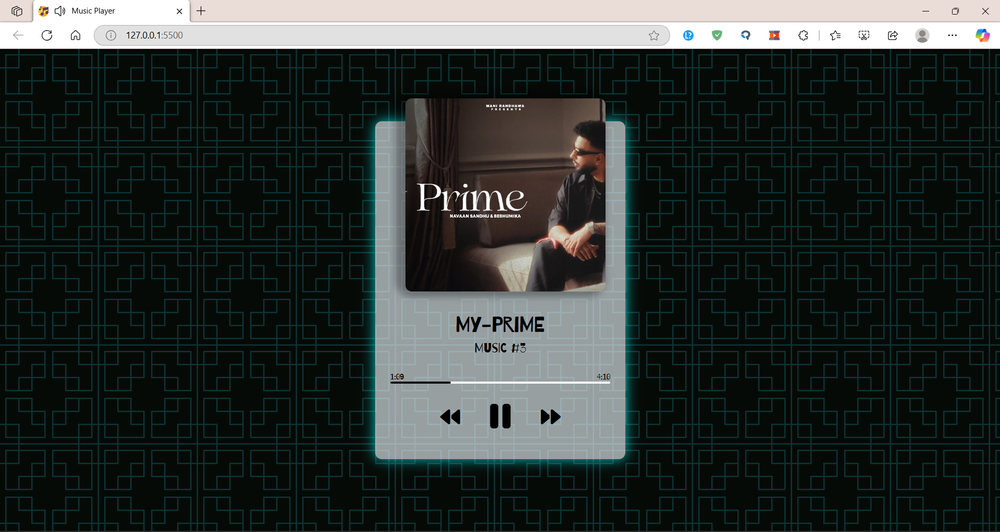

# Music Player Site

This project is a simple music player website built using JavaScript, HTML, and CSS. It is designed to be responsive and allows users to change the audio current time by clicking on the progress bar.

## Features

- Responsive design  
- Audio playback controls (play, pause, volume control)  
- Progress bar for tracking audio playback and seeking  
- Clickable progress bar to change the audio current time  

## Technologies Used

- JavaScript  
- HTML5  
- CSS3  

## Preview

  

🎥 **Watch the Preview Video:** [Click Here](https://drive.google.com/file/d/1ShbyOBtdDkslszrf-BKkOinHxNwS0Owl/view?usp=sharing)  

## License

This project is licensed under the MIT License - see the [LICENSE](LICENSE) file for details.

## How to Use

1. Clone the repository: `git clone https://github.com/your-username/music-player-site.git`
2. Open `index.html` in your web browser.
